# Reading Tracker 프로젝트 아키텍처 다이어그램

## 프로젝트 개요
독서 추적 애플리케이션으로 사용자가 읽고 싶은 책, 읽는 중인 책, 완독한 책을 관리할 수 있는 Spring Boot 기반 웹 애플리케이션입니다.

## 기술 스택
- **Backend**: Spring Boot 3.2.0, Java 17
- **Database**: MySQL 8.0
- **ORM**: JPA/Hibernate
- **Security**: Spring Security + JWT
- **Migration**: Flyway
- **API Documentation**: OpenAPI/Swagger
- **External API**: 알라딘 Open API

## 아키텍처 다이어그램

```mermaid
graph TB
    %% 외부 시스템
    Client[웹 클라이언트<br/>React/Vue/Angular]
    AladinAPI[알라딘 Open API<br/>도서 정보 검색]
    
    %% 프레젠테이션 레이어
    subgraph "Presentation Layer"
        AuthController[AuthController<br/>인증 관련 API]
        BookController[BookController<br/>도서 관리 API]
        UserController[UserController<br/>사용자 관리 API]
        SwaggerUI[Swagger UI<br/>API 문서화]
    end
    
    %% 보안 레이어
    subgraph "Security Layer"
        SecurityConfig[SecurityConfig<br/>보안 설정]
        JwtAuthFilter[JwtAuthenticationFilter<br/>JWT 인증 필터]
        JwtService[JwtService<br/>JWT 토큰 관리]
        JwtUtil[JwtUtil<br/>JWT 유틸리티]
    end
    
    %% 서비스 레이어
    subgraph "Service Layer"
        AuthService[AuthService<br/>인증 비즈니스 로직]
        BookService[BookService<br/>도서 비즈니스 로직]
        UserService[UserService<br/>사용자 비즈니스 로직]
        AladinApiService[AladinApiService<br/>외부 API 연동]
        UserDeviceService[UserDeviceService<br/>디바이스 관리]
        ValidationService[ValidationService<br/>유효성 검증]
    end
    
    %% 데이터 액세스 레이어
    subgraph "Data Access Layer"
        UserRepository[UserRepository<br/>사용자 데이터]
        BookRepository[BookRepository<br/>도서 데이터]
        UserBookRepository[UserBookRepository<br/>사용자-도서 관계]
        UserDeviceRepository[UserDeviceRepository<br/>디바이스 데이터]
        RefreshTokenRepository[RefreshTokenRepository<br/>리프레시 토큰]
        PasswordResetTokenRepository[PasswordResetTokenRepository<br/>비밀번호 재설정 토큰]
    end
    
    %% 엔티티 레이어
    subgraph "Entity Layer"
        User[User<br/>사용자 엔티티]
        Book[Book<br/>도서 엔티티]
        UserBook[UserBook<br/>사용자-도서 관계 엔티티]
        UserDevice[UserDevice<br/>디바이스 엔티티]
        RefreshToken[RefreshToken<br/>리프레시 토큰 엔티티]
        PasswordResetToken[PasswordResetToken<br/>비밀번호 재설정 토큰 엔티티]
    end
    
    %% 데이터베이스
    MySQL[(MySQL Database<br/>reading_tracker)]
    
    %% 설정 및 유틸리티
    subgraph "Configuration & Utilities"
        AppConfig[Application Configuration<br/>application.yml]
        CorsConfig[CORS 설정]
        JpaConfig[JPA 설정]
        PasswordConfig[비밀번호 암호화 설정]
        GlobalExceptionHandler[전역 예외 처리]
        PasswordValidator[비밀번호 검증 유틸리티]
    end
    
    %% DTO 레이어
    subgraph "DTO Layer"
        RequestDTO[Request DTO<br/>클라이언트 요청 데이터]
        ResponseDTO[Response DTO<br/>클라이언트 응답 데이터]
        CommandDTO[Command DTO<br/>서버 내부 명령 데이터]
        ResultDTO[Result DTO<br/>서버 내부 결과 데이터]
        ApiResponse[ApiResponse<br/>통일된 API 응답 형식]
    end
    
    %% 연결 관계
    Client --> AuthController
    Client --> BookController
    Client --> UserController
    Client --> SwaggerUI
    
    AuthController --> AuthService
    BookController --> BookService
    BookController --> AladinApiService
    UserController --> UserService
    
    AuthService --> UserService
    AuthService --> JwtService
    AuthService --> UserDeviceService
    AuthService --> ValidationService
    
    BookService --> AladinApiService
    BookService --> UserService
    
    AladinApiService --> AladinAPI
    
    AuthService --> UserRepository
    AuthService --> PasswordResetTokenRepository
    BookService --> BookRepository
    BookService --> UserBookRepository
    UserService --> UserRepository
    UserDeviceService --> UserDeviceRepository
    JwtService --> RefreshTokenRepository
    JwtService --> UserDeviceRepository
    
    UserRepository --> User
    BookRepository --> Book
    UserBookRepository --> UserBook
    UserDeviceRepository --> UserDevice
    RefreshTokenRepository --> RefreshToken
    PasswordResetTokenRepository --> PasswordResetToken
    
    User --> MySQL
    Book --> MySQL
    UserBook --> MySQL
    UserDevice --> MySQL
    RefreshToken --> MySQL
    PasswordResetToken --> MySQL
    
    SecurityConfig --> JwtAuthFilter
    JwtAuthFilter --> JwtService
    JwtService --> JwtUtil
    
    AuthController --> RequestDTO
    AuthController --> ResponseDTO
    BookController --> RequestDTO
    BookController --> ResponseDTO
    UserController --> RequestDTO
    UserController --> ResponseDTO
    
    AuthService --> CommandDTO
    AuthService --> ResultDTO
    BookService --> CommandDTO
    BookService --> ResultDTO
    UserService --> CommandDTO
    UserService --> ResultDTO
    
    AuthController --> ApiResponse
    BookController --> ApiResponse
    UserController --> ApiResponse
    
    %% 스타일링
    classDef controller fill:#e1f5fe
    classDef service fill:#f3e5f5
    classDef repository fill:#e8f5e8
    classDef entity fill:#fff3e0
    classDef config fill:#fce4ec
    classDef dto fill:#f1f8e9
    classDef external fill:#ffebee
    
    class AuthController,BookController,UserController,SwaggerUI controller
    class AuthService,BookService,UserService,AladinApiService,UserDeviceService,ValidationService,JwtService service
    class UserRepository,BookRepository,UserBookRepository,UserDeviceRepository,RefreshTokenRepository,PasswordResetTokenRepository repository
    class User,Book,UserBook,UserDevice,RefreshToken,PasswordResetToken entity
    class SecurityConfig,JwtAuthFilter,JwtUtil,AppConfig,CorsConfig,JpaConfig,PasswordConfig,GlobalExceptionHandler,PasswordValidator config
    class RequestDTO,ResponseDTO,CommandDTO,ResultDTO,ApiResponse dto
    class Client,AladinAPI,MySQL external
```



## 레이어별 상세 설명

### 1. Presentation Layer (프레젠테이션 레이어)
- **AuthController**: 인증 관련 API (회원가입, 로그인, 토큰 갱신, 비밀번호 재설정)
- **BookController**: 도서 관리 API (검색, 서재 추가/제거, 상태 변경)
- **UserController**: 사용자 관리 API (프로필 조회/수정)
- **SwaggerUI**: API 문서화 및 테스트 인터페이스

### 2. Security Layer (보안 레이어)
- **SecurityConfig**: Spring Security 설정 (인증/인가 규칙)
- **JwtAuthenticationFilter**: JWT 토큰 검증 필터
- **JwtService**: JWT 토큰 생성, 검증, 갱신 로직
- **JwtUtil**: JWT 토큰 생성/파싱 유틸리티

### 3. Service Layer (서비스 레이어)
- **AuthService**: 인증 관련 비즈니스 로직
- **BookService**: 도서 관리 비즈니스 로직
- **UserService**: 사용자 관리 비즈니스 로직
- **AladinApiService**: 알라딘 API 연동 서비스
- **UserDeviceService**: 디바이스 관리 서비스
- **ValidationService**: 데이터 유효성 검증 서비스

### 4. Data Access Layer (데이터 액세스 레이어)
- **Repository 인터페이스들**: JPA Repository를 통한 데이터 접근
- 각 엔티티별로 전용 Repository 제공

### 5. Entity Layer (엔티티 레이어)
- **User**: 사용자 정보 엔티티
- **Book**: 도서 정보 엔티티
- **UserBook**: 사용자-도서 관계 엔티티 (독서 상태 관리)
- **UserDevice**: 사용자 디바이스 정보 엔티티
- **RefreshToken**: JWT 리프레시 토큰 엔티티
- **PasswordResetToken**: 비밀번호 재설정 토큰 엔티티

### 6. DTO Layer (데이터 전송 객체 레이어)
- **RequestDTO**: 클라이언트에서 서버로 전송되는 요청 데이터
- **ResponseDTO**: 서버에서 클라이언트로 전송되는 응답 데이터
- **CommandDTO**: 서버 내부에서 사용되는 명령 데이터
- **ResultDTO**: 서버 내부에서 사용되는 결과 데이터
- **ApiResponse**: 통일된 API 응답 형식

## 주요 기능 흐름

### 1. 사용자 인증 흐름
```
클라이언트 → AuthController → AuthService → UserRepository → MySQL
                ↓
            JwtService → RefreshTokenRepository → MySQL
```

### 2. 도서 검색 및 추가 흐름
```
클라이언트 → BookController → AladinApiService → 알라딘 API
                ↓
            BookService → BookRepository → MySQL
                ↓
            UserBookRepository → MySQL
```

### 3. JWT 인증 흐름
```
요청 → JwtAuthenticationFilter → JwtService → JwtUtil
                ↓
            RefreshTokenRepository → MySQL
```

## 보안 특징
- JWT 기반 Stateless 인증
- Token Rotation을 통한 보안 강화
- 디바이스별 토큰 관리
- 비밀번호 암호화 (BCrypt)
- CORS 설정
- 계정 잠금 기능 (5회 실패 시)

## 데이터베이스 특징
- Flyway를 통한 스키마 버전 관리
- JPA Auditing을 통한 생성/수정 시간 자동 관리
- 외래키 제약조건을 통한 데이터 무결성 보장
- 인덱스를 통한 성능 최적화
