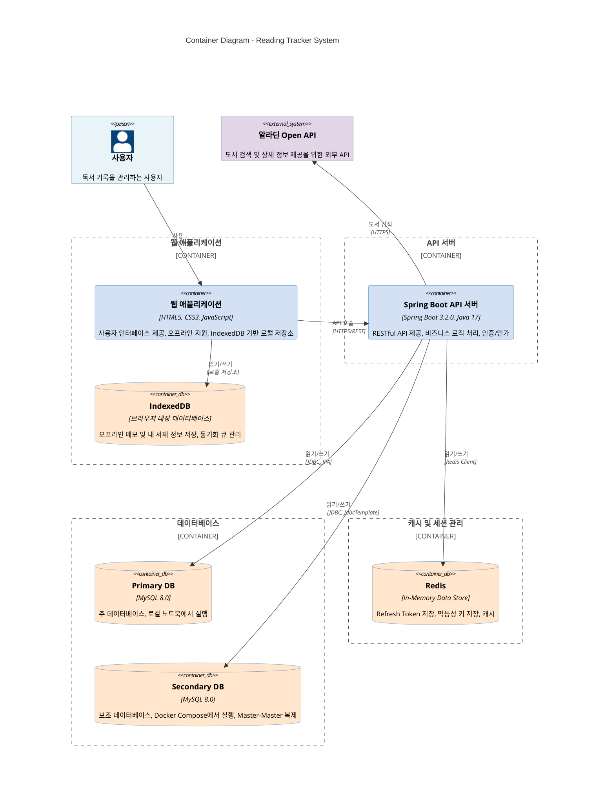

# C4 Model - Container Diagram (Level 2)

> **작성일**: 2025-12-09  
> **목적**: Reading Tracker 시스템의 Container Diagram (Level 2)  
> **범위**: 시스템을 구성하는 주요 컨테이너 및 외부 시스템

---

## Container Diagram

---

## 컨테이너 상세 설명

### 1. 웹 애플리케이션 (Web Application)

**기술 스택**:
- HTML5, CSS3, JavaScript (ES6+)
- ES Modules
- Fetch API
- Service Worker

**주요 기능**:
- 사용자 인터페이스 제공
- 오프라인 지원 (IndexedDB 기반)
- 네트워크 상태 모니터링
- 자동 동기화 (네트워크 재연결 시)
- 하이브리드 전략 (온라인: 서버 우선, 오프라인: 로컬 우선)

**책임**:
- 사용자 입력 처리
- API 호출 및 응답 처리
- 오프라인 데이터 관리
- 동기화 큐 관리
- 네트워크 상태 감지 및 이벤트 발행

### 2. IndexedDB

**유형**: 브라우저 내장 데이터베이스

**주요 데이터**:
- `offline_memos`: 오프라인 메모 저장
  - 로컬 ID, 서버 ID, 동기화 상태
  - 최근 7일 메모만 저장 (하이브리드 전략)
- `offline_books`: 오프라인 내 서재 정보 저장
  - 로컬 ID, 서버 ID, 동기화 상태
- `sync_queue`: 동기화 큐
  - 작업 타입 (CREATE, UPDATE, DELETE)
  - 큐 항목 상태 (PENDING, SYNCING, SUCCESS, FAILED)
  - 멱등성 키 (CREATE 작업용)

**책임**:
- 오프라인 데이터 영구 저장
- 동기화 큐 관리
- 로컬 데이터 조회 및 수정

### 3. Spring Boot API 서버

**기술 스택**:
- Spring Boot 3.2.0
- Java 17
- Spring Security
- Spring Data JPA
- JWT

**주요 기능**:
- RESTful API 제공
- 인증/인가 처리
- 비즈니스 로직 처리
- Dual Master Read/Write 처리
- 멱등성 키 검증

**책임**:
- 클라이언트 요청 처리
- 데이터베이스 읽기/쓰기 (Dual Master)
- Redis를 통한 세션 및 캐시 관리
- 외부 API (알라딘) 연동

**주요 엔드포인트**:
- `/api/v1/auth/*`: 인증 관련
- `/api/v1/books/*`: 도서 검색 및 관리
- `/api/v1/memos/*`: 메모 관리
- `/api/v1/users/*`: 사용자 관리

### 4. Primary DB

**유형**: 관계형 데이터베이스 (MySQL 8.0)

**위치**: 로컬 노트북

**주요 테이블**:
- `users`: 사용자 정보
- `user_shelf_books`: 내 서재 정보
- `memos`: 메모 정보
- `tags`: 태그 정보
- `memo_tags`: 메모-태그 연결
- `user_devices`: 사용자 디바이스 정보

**책임**:
- 주 데이터 저장소
- Master-Master 복제의 Primary 역할
- 모든 Write 작업의 첫 번째 대상
- Read 작업의 첫 번째 시도 대상

### 5. Secondary DB

**유형**: 관계형 데이터베이스 (MySQL 8.0)

**위치**: Docker Compose

**주요 테이블**:
- Primary DB와 동일한 스키마

**책임**:
- 보조 데이터 저장소
- Master-Master 복제의 Secondary 역할
- Primary DB 실패 시 Read Failover 대상
- Primary DB Write 성공 후 Dual Write 대상

**복제 방식**:
- MySQL Master-Master 복제
- 양방향 동기화

### 6. Redis

**유형**: In-Memory Data Store

**주요 데이터**:
- Refresh Token 저장
  - Key: `refresh_token:{userId}`
  - TTL: 7일
- 멱등성 키 저장
  - Key: `idempotency:{idempotencyKey}`
  - TTL: 24시간
- 캐시 데이터 (선택적)

**책임**:
- 세션 관리 (Refresh Token)
- 멱등성 보장 (중복 요청 방지)
- 캐시 데이터 저장

### 7. 알라딘 Open API

**유형**: 외부 시스템

**주요 기능**:
- 도서 검색
- 도서 상세 정보 조회

**책임**:
- 도서 검색 결과 제공
- 도서 상세 정보 제공

---

## 컨테이너 간 통신

### 1. 사용자 ↔ 웹 애플리케이션
- **프로토콜**: HTTPS
- **통신 방식**: 브라우저를 통한 직접 상호작용
- **데이터**: 사용자 입력, UI 렌더링

### 2. 웹 애플리케이션 ↔ IndexedDB
- **프로토콜**: 브라우저 내장 API
- **통신 방식**: IndexedDB API
- **데이터**: 오프라인 메모, 내 서재 정보, 동기화 큐

### 3. 웹 애플리케이션 ↔ API 서버
- **프로토콜**: HTTPS
- **통신 방식**: RESTful API
- **데이터**: 
  - 요청: 메모 생성/수정/삭제, 내 서재 관리, 인증
  - 응답: 메모 목록, 서재 정보, 인증 토큰

### 4. API 서버 ↔ Primary DB
- **프로토콜**: JDBC
- **통신 방식**: 
  - Read: JPA Repository
  - Write: JPA Repository
- **데이터**: 사용자 정보, 메모, 내 서재 정보

### 5. API 서버 ↔ Secondary DB
- **프로토콜**: JDBC
- **통신 방식**: 
  - Read: JPA Repository (Failover 시)
  - Write: JdbcTemplate (Dual Write)
- **데이터**: Primary DB와 동일한 데이터

### 6. API 서버 ↔ Redis
- **프로토콜**: Redis Protocol
- **통신 방식**: Redis Client
- **데이터**: Refresh Token, 멱등성 키

### 7. API 서버 ↔ 알라딘 Open API
- **프로토콜**: HTTPS
- **통신 방식**: RESTful API
- **데이터**: 도서 검색 요청, 도서 상세 정보 응답

---

## 기술 결정 사항

### 웹 애플리케이션
- **선택**: Vanilla JavaScript (ES6+)
- **이유**: 프레임워크 의존성 없이 경량화, 오프라인 지원 용이

### IndexedDB
- **선택**: 브라우저 내장 IndexedDB
- **이유**: 오프라인 데이터 영구 저장, 구조화된 데이터 저장 지원

### API 서버
- **선택**: Spring Boot
- **이유**: 엔터프라이즈급 기능, Spring Security 통합, JPA 지원

### 데이터베이스
- **선택**: MySQL 8.0 (Master-Master 복제)
- **이유**: 고가용성, 데이터 일관성, Dual Master 지원

### Redis
- **선택**: Redis
- **이유**: 빠른 세션 관리, 멱등성 키 저장, TTL 지원

---

## 비기능 요구사항

### 가용성 (Availability)
- **Dual Master 구성**: Primary DB 장애 시 Secondary DB로 Failover
- **Read Failover**: Primary DB 실패 시 Secondary DB에서 읽기
- **오프라인 지원**: 네트워크 장애 시에도 로컬 데이터 사용 가능

### 일관성 (Consistency)
- **Dual Write**: Primary → Secondary 순차 쓰기
- **보상 트랜잭션**: Secondary 실패 시 Primary 롤백
- **동기화 큐**: 오프라인 데이터의 순서 보장

### 성능 (Performance)
- **Redis 캐시**: 세션 및 멱등성 키 빠른 조회
- **IndexedDB**: 로컬 데이터 빠른 조회
- **최근 7일 메모만 저장**: IndexedDB 용량 최적화

### 확장성 (Scalability)
- **Master-Master 복제**: 읽기 부하 분산 가능
- **Docker Compose**: Secondary DB 독립 배포 가능

---

## 보안 고려사항

### 인증/인가
- **JWT 기반 인증**: Access Token (1시간) + Refresh Token (7일)
- **Redis 세션 관리**: Refresh Token 안전 저장
- **디바이스별 토큰 관리**: 다중 디바이스 지원

### 데이터 보호
- **HTTPS 통신**: 모든 클라이언트-서버 통신 암호화
- **비밀번호 해싱**: BCrypt를 통한 비밀번호 저장
- **멱등성 키**: 중복 요청 방지

---

**문서 버전**: 1.0  
**최종 업데이트**: 2025-12-09  
**작성자**: Development Team

