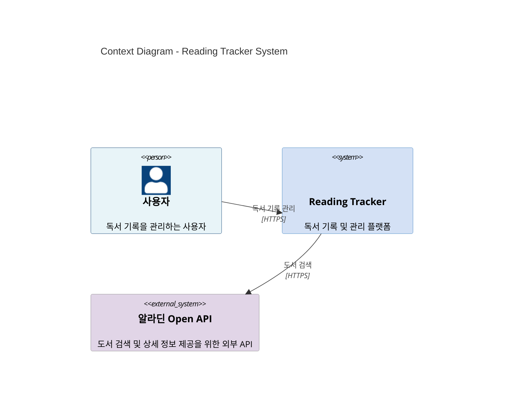

# C4 Model - Context Diagram (Level 1)

> **작성일**: 2025-12-09  
> **목적**: Reading Tracker 시스템의 Context Diagram (Level 1)  
> **범위**: 시스템의 모든 기능과 외부 액터 간의 상호작용

---

## Context Diagram



---

## 시스템 기능 상세

### 1. 인증 및 사용자 관리

#### 1.1 회원가입
- **기능**: 새로운 사용자 계정 생성
- **사용자 액션**: 회원가입 화면에서 정보 입력 및 제출
- **시스템 처리**: 
  - 로그인 ID 및 이메일 중복 확인
  - 비밀번호 검증
  - 사용자 정보 저장 (Primary/Secondary DB)
  - JWT 토큰 발급

#### 1.2 로그인
- **기능**: 사용자 인증 및 세션 생성
- **사용자 액션**: 로그인 화면에서 ID/비밀번호 입력
- **시스템 처리**:
  - 사용자 인증 (Primary/Secondary DB)
  - Access Token (1시간) 및 Refresh Token (7일) 발급
  - Refresh Token을 Redis에 저장
  - 디바이스 정보 등록

#### 1.3 아이디 찾기
- **기능**: 이메일과 이름을 통한 로그인 ID 조회
- **사용자 액션**: 아이디 찾기 화면에서 이메일과 이름 입력
- **시스템 처리**: 
  - 사용자 정보 조회 (Primary/Secondary DB)
  - 이메일로 로그인 ID 전송

#### 1.4 비밀번호 재설정
- **기능**: 2단계 인증을 통한 비밀번호 변경
- **사용자 액션**: 
  1. 계정 확인 (이메일, 이름, 로그인 ID)
  2. 인증 코드 입력
  3. 새 비밀번호 설정
- **시스템 처리**:
  - 계정 확인 (Primary/Secondary DB)
  - 인증 코드 생성 및 이메일 전송
  - 인증 코드 검증
  - 비밀번호 업데이트 (Primary/Secondary DB)

#### 1.5 중복 확인
- **기능**: 로그인 ID 및 이메일 중복 검사
- **사용자 액션**: 회원가입 화면에서 실시간 중복 확인
- **시스템 처리**: 
  - 로그인 ID 중복 확인 (Primary/Secondary DB)
  - 이메일 중복 확인 (Primary/Secondary DB)

#### 1.6 사용자 프로필 조회
- **기능**: 현재 로그인한 사용자의 프로필 정보 조회
- **사용자 액션**: 프로필 화면 접근
- **시스템 처리**: 
  - JWT 토큰 검증
  - 사용자 정보 조회 (Primary/Secondary DB)

#### 1.7 토큰 갱신
- **기능**: Access Token 만료 시 Refresh Token으로 갱신
- **사용자 액션**: 자동 처리 (프론트엔드)
- **시스템 처리**:
  - Refresh Token 검증 (Redis)
  - 새 Access Token 발급
  - Token Rotation (선택적)

---

### 2. 도서 검색 및 관리

#### 2.1 도서 검색
- **기능**: 알라딘 Open API를 활용한 실시간 도서 검색
- **사용자 액션**: 도서 검색 화면에서 검색어 입력
- **시스템 처리**:
  - 알라딘 Open API 호출 (도서명, 저자명, 출판사명 검색)
  - 검색 결과 반환 (페이지네이션 지원)

#### 2.2 도서 상세 정보 조회
- **기능**: ISBN을 통한 도서 상세 정보 조회
- **사용자 액션**: 도서 카드 클릭 또는 ISBN 입력
- **시스템 처리**:
  - 알라딘 Open API 호출 (ISBN 기반 상세 정보)
  - 사용자의 서재 정보 확인 (해당 도서가 서재에 있는 경우)
  - 통합 정보 반환

---

### 3. 내 서재 관리

#### 3.1 내 서재에 책 추가
- **기능**: 검색한 도서를 개인 서재에 추가
- **사용자 액션**: 도서 상세 화면에서 "서재에 추가" 클릭
- **시스템 처리**:
  - 카테고리별 필수 정보 입력 모달 표시
  - 사용자 입력 정보 저장 (Primary/Secondary DB)
  - 카테고리별 필수 정보:
    - 읽을 예정 (ToRead): 기대감 (선택)
    - 읽는 중 (Reading): 독서 시작일, 현재 읽은 페이지, 구매/대여 여부
    - 거의 다 읽음 (AlmostFinished): 독서 시작일, 현재 읽은 페이지 (진행률 81-99%)
    - 완독 (Finished): 독서 시작일, 독서 종료일, 평점 (필수), 후기 (선택)

#### 3.2 서재에서 책 제거
- **기능**: 내 서재에서 도서 삭제
- **사용자 액션**: 도서 상세 화면 또는 서재 화면에서 "삭제" 클릭
- **시스템 처리**:
  - 연관 메모 자동 삭제 (Primary/Secondary DB)
  - 서재 정보 삭제 (Primary/Secondary DB)

#### 3.3 서재 목록 조회
- **기능**: 카테고리별 서재 목록 조회 및 정렬
- **사용자 액션**: 내 서재 화면에서 카테고리 선택 및 정렬 옵션 선택
- **시스템 처리**:
  - 카테고리별 필터링 (ToRead, Reading, AlmostFinished, Finished)
  - 정렬 옵션 적용 (도서명, 저자명, 출판사명, 장르별)
  - 서재 정보 조회 (Primary/Secondary DB)

#### 3.4 책 상세 정보 수정
- **기능**: 서재에 있는 책의 상세 정보 수정
- **사용자 액션**: 도서 상세 화면에서 정보 수정
- **시스템 처리**:
  - 카테고리 변경
  - 기대감 수정
  - 독서 진행률 수정 (현재 읽은 페이지)
  - 평점 및 후기 수정
  - 정보 업데이트 (Primary/Secondary DB)

#### 3.5 독서 시작하기
- **기능**: ToRead 카테고리 책을 Reading 카테고리로 변경
- **사용자 액션**: 도서 상세 화면에서 "독서 시작하기" 클릭
- **시스템 처리**:
  - 카테고리 변경 (ToRead → Reading)
  - 독서 시작일 설정
  - 정보 업데이트 (Primary/Secondary DB)

#### 3.6 독서 완료하기
- **기능**: 진행률 100%인 책을 Finished 카테고리로 변경
- **사용자 액션**: 도서 상세 화면에서 "독서 완료하기" 클릭
- **시스템 처리**:
  - 진행률 확인 (100%인 경우만 가능)
  - 카테고리 변경 (Reading/AlmostFinished → Finished)
  - 독서 종료일 설정
  - 평점 및 후기 입력 (필수)
  - 정보 업데이트 (Primary/Secondary DB)

---

### 4. 독서 메모 관리

#### 4.1 메모 작성
- **기능**: 독서 중 실시간 메모 작성
- **사용자 액션**: 오늘의 흐름 화면에서 메모 입력 및 저장
- **시스템 처리**:
  - 페이지 번호 기록
  - 태그 선택 및 자동 생성/연결
  - 메모 작성 시간 자동 기록 (한국 시간대)
  - 메모 저장 (Primary/Secondary DB)
  - 멱등성 키 검증 (중복 요청 방지)

#### 4.2 메모 수정
- **기능**: 작성한 메모의 내용 및 태그 수정
- **사용자 액션**: 메모 카드에서 "수정" 클릭
- **시스템 처리**:
  - 메모 내용 수정
  - 태그 수정 (자동 생성/연결)
  - pageNumber는 수정 불가 (메타데이터)
  - 정보 업데이트 (Primary/Secondary DB)

#### 4.3 메모 삭제
- **기능**: 작성한 메모 삭제
- **사용자 액션**: 메모 카드에서 "삭제" 클릭
- **시스템 처리**:
  - 메모 삭제 (Primary/Secondary DB)
  - 연관 태그 연결 삭제 (메모가 없는 태그는 유지)

#### 4.4 특정 책의 메모 목록 조회
- **기능**: 특정 책에 작성된 모든 메모 조회
- **사용자 액션**: 도서 상세 화면 또는 메모 목록 화면 접근
- **시스템 처리**:
  - 책 ID 기반 메모 조회 (Primary/Secondary DB)
  - 날짜 필터링 (선택적)
  - 메모 목록 반환

---

### 5. 오늘의 흐름

#### 5.1 오늘의 흐름 조회
- **기능**: 특정 날짜의 독서 메모를 다양한 방식으로 조회
- **사용자 액션**: 오늘의 흐름 화면에서 날짜 선택 및 그룹화 방식 선택
- **시스템 처리**:
  - 날짜별 메모 조회 (Primary/Secondary DB)
  - 그룹화 방식에 따른 정렬:
    - **세션 모드 (SESSION)**: 책별로 그룹화 (프론트엔드에서 시간축 재배치)
    - **책 모드 (BOOK)**: 책별로 그룹화
    - **태그 모드 (TAG)**: 태그별로 그룹화 (태그 대분류 선택 가능)
  - 그룹화된 메모 목록 반환

#### 5.2 메모 작성 날짜 목록 조회
- **기능**: 독서 캘린더용 메모 작성 날짜 목록 조회
- **사용자 액션**: 캘린더 화면 접근
- **시스템 처리**:
  - 년도 및 월 기준 메모 작성 날짜 조회 (Primary/Secondary DB)
  - 날짜 목록 반환 (YYYY-MM-DD 형식)

#### 5.3 최근 메모 작성 책 목록 조회
- **기능**: 최근 메모를 작성한 책 목록 조회
- **사용자 액션**: 최근 메모 작성 책 목록 화면 접근
- **시스템 처리**:
  - 기간 설정 (기본값: 1개월)
  - 최근 메모 작성 책 조회 (Primary/Secondary DB)
  - 책 목록 반환

#### 5.4 책 덮기 (독서 활동 종료)
- **기능**: 독서 활동 종료 및 마지막 페이지 기록
- **사용자 액션**: 오늘의 흐름 화면에서 "책 덮기" 클릭
- **시스템 처리**:
  - 마지막으로 읽은 페이지 기록
  - ToRead 카테고리 책의 경우 독서 시작일을 첫 메모 작성 날짜로 자동 설정
  - 진행률 100%인 경우 Finished 카테고리로 변경 및 평점/후기 입력
  - 정보 업데이트 (Primary/Secondary DB)

---

### 6. 태그 시스템

#### 6.1 태그 목록 조회
- **기능**: 모든 태그 목록 조회
- **사용자 액션**: 태그 선택 화면 접근
- **시스템 처리**:
  - 태그 목록 조회 (Primary/Secondary DB)
  - 태그 목록 반환

#### 6.2 카테고리별 태그 목록 조회
- **기능**: 태그 대분류별 태그 목록 조회
- **사용자 액션**: 태그 선택 화면에서 대분류 선택
- **시스템 처리**:
  - 태그 대분류 필터링 (TYPE, TOPIC 등)
  - 태그 목록 조회 (Primary/Secondary DB)
  - 태그 목록 반환

---

### 7. 헬스체크

#### 7.1 알라딘 API 헬스체크
- **기능**: 알라딘 Open API 연결 상태 확인
- **사용자 액션**: 자동 처리 (네트워크 모니터링)
- **시스템 처리**:
  - 알라딘 API 헬스체크 엔드포인트 호출
  - 연결 상태 반환

---

## 기능별 시스템 상호작용 요약

### 인증 및 사용자 관리
```
사용자 → Reading Tracker
  - 회원가입, 로그인, 아이디 찾기, 비밀번호 재설정
  - 중복 확인, 프로필 조회, 토큰 갱신
```

### 도서 검색 및 관리
```
사용자 → Reading Tracker → 알라딘 Open API
  - 도서 검색, 도서 상세 정보 조회
```

### 내 서재 관리
```
사용자 → Reading Tracker
  - 서재에 책 추가/제거
  - 서재 목록 조회 및 정렬
  - 책 상세 정보 수정
  - 독서 시작하기/완료하기
```

### 독서 메모 관리
```
사용자 → Reading Tracker
  - 메모 작성/수정/삭제
  - 특정 책의 메모 목록 조회
```

### 오늘의 흐름
```
사용자 → Reading Tracker
  - 오늘의 흐름 조회 (세션/책/태그 모드)
  - 메모 작성 날짜 목록 조회
  - 최근 메모 작성 책 목록 조회
  - 책 덮기
```

### 태그 시스템
```
사용자 → Reading Tracker
  - 태그 목록 조회
  - 카테고리별 태그 목록 조회
```

---

## 비기능 요구사항 (전제 조건)

다음 비기능 요구사항은 모든 기능이 작동하는 전제 조건으로 설정되어 있으며, Context Diagram에는 직접적으로 표현되지 않습니다:

### 시나리오 1: 네트워크 접속 해제 시 오프라인 우선 & 네트워크 재접속 시 데이터 동기화 & 네트워크 접속 연결 시 서버DB 우선
- **적용 범위**: 메모 작성/수정/삭제, 내 서재 정보 추가/수정/삭제
- **전제 조건**: 
  - 오프라인 상태에서도 기능 사용 가능 (IndexedDB 기반)
  - 네트워크 재연결 시 자동 동기화
  - 동기화 완료 후 서버DB 우선으로 전환

### 시나리오 2: MySQL 이중화 및 양방향 동기화
- **적용 범위**: 모든 데이터베이스 작업
- **전제 조건**:
  - Primary DB 실패 시 Secondary DB로 Read Failover
  - Write 작업은 Primary → Secondary 순차 처리
  - Secondary 실패 시 Primary 보상 트랜잭션 실행

---

## 시스템 경계

**Reading Tracker 시스템**은 다음을 포함합니다:
- 웹 애플리케이션 (프론트엔드)
- Spring Boot API 서버 (백엔드)
- Primary DB (MySQL)
- Secondary DB (MySQL)
- Redis (세션 및 캐시 관리)
- IndexedDB (오프라인 데이터 저장)

**외부 시스템**:
- 알라딘 Open API (도서 검색 및 상세 정보 제공)

---

**문서 버전**: 1.0  
**최종 업데이트**: 2025-12-09  
**작성자**: Development Team

