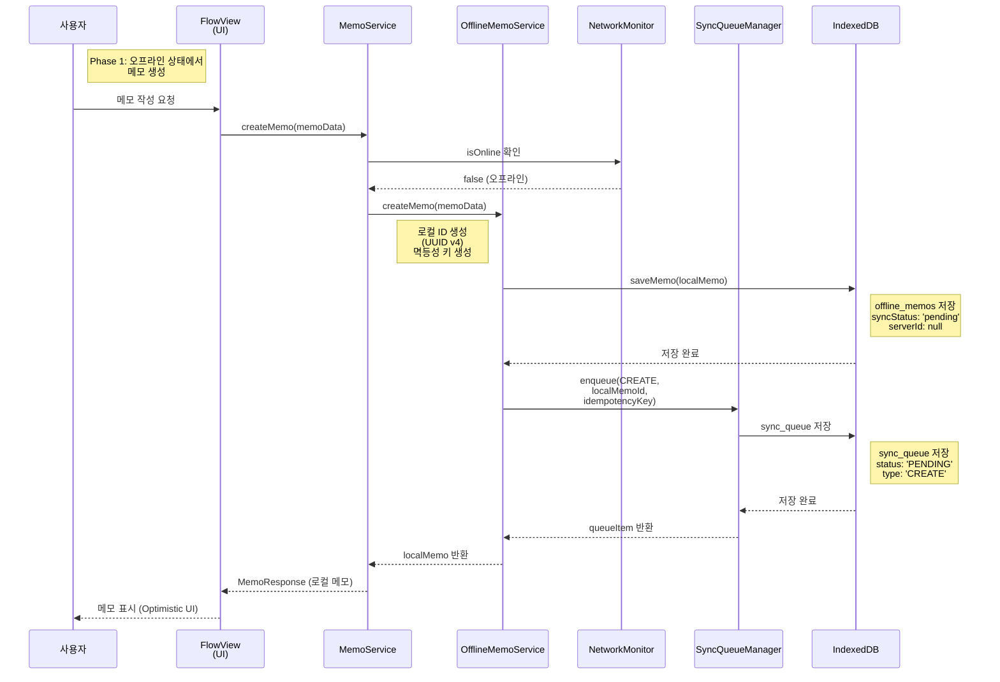
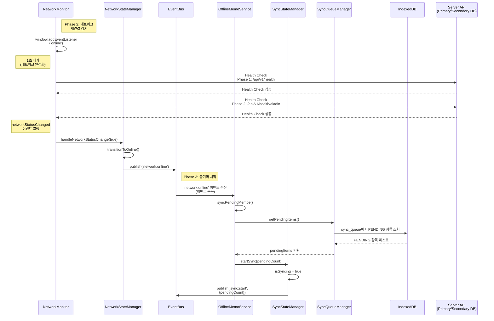
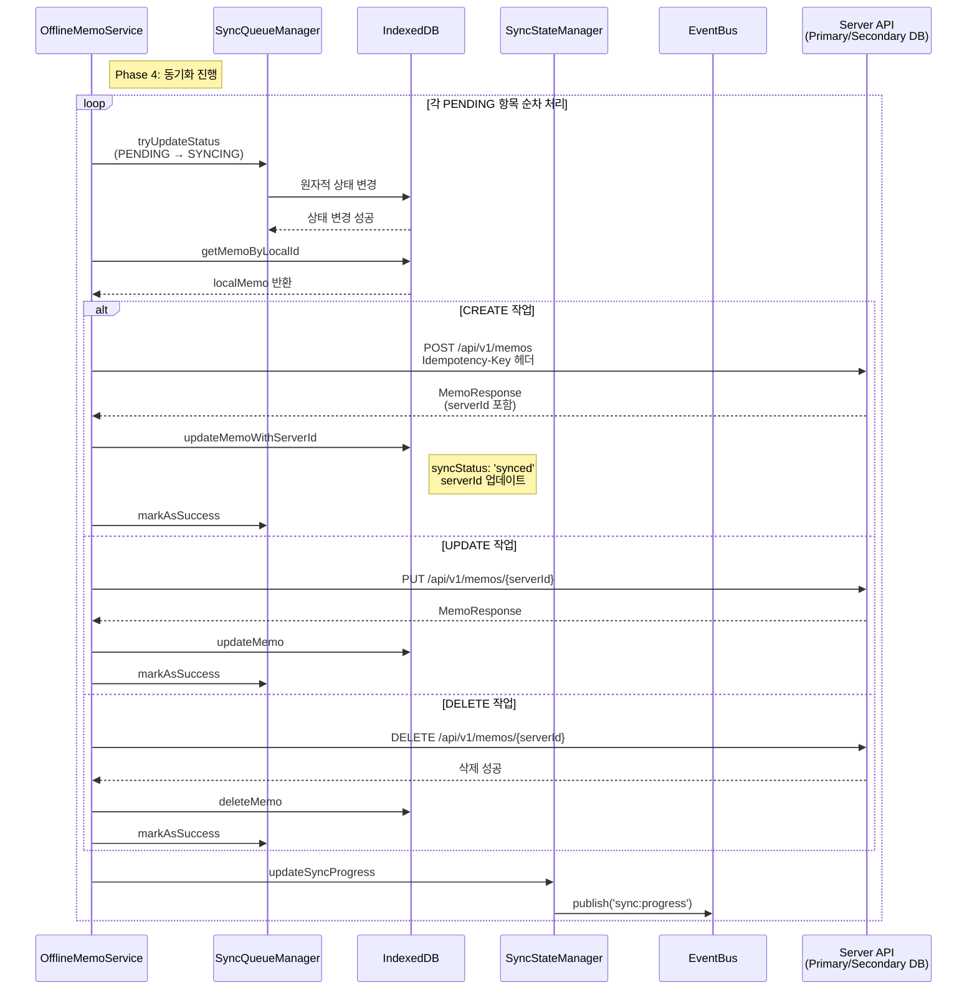
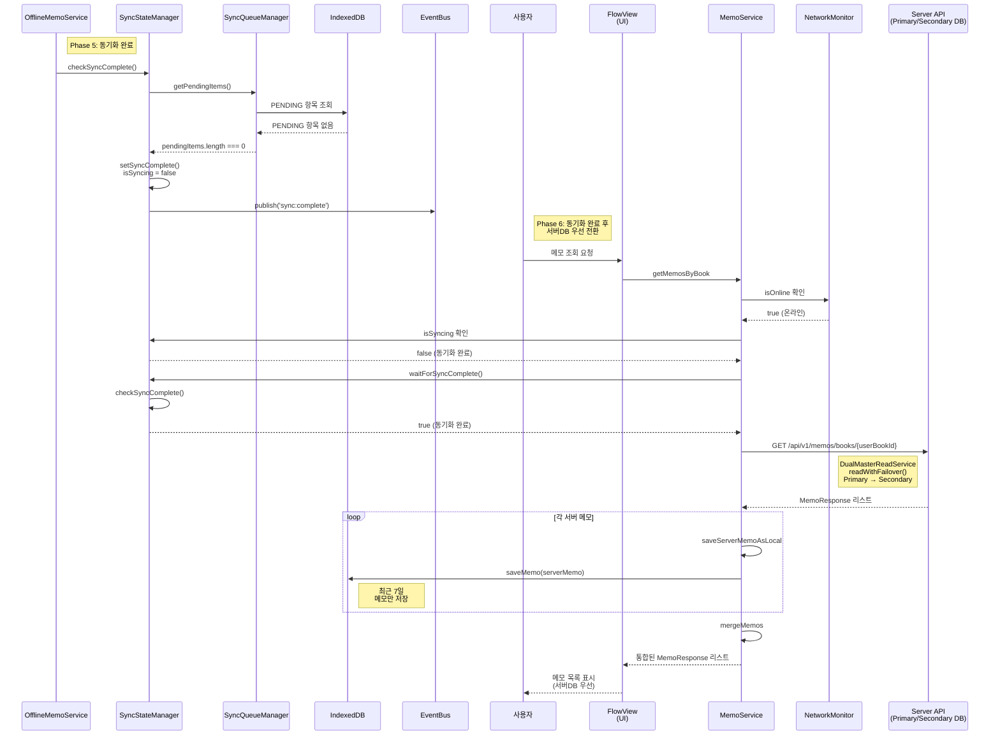
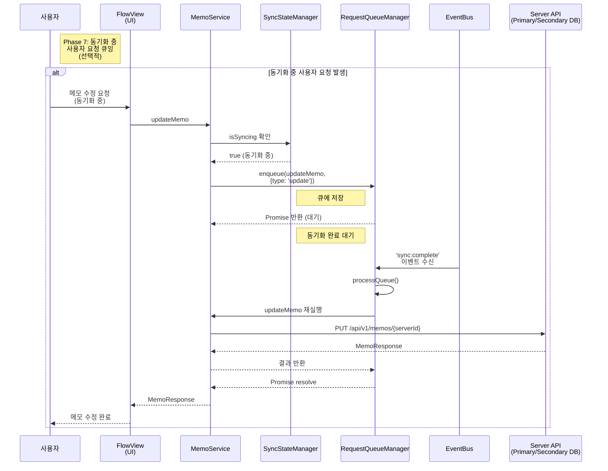

# 시나리오 1: 네트워크 접속 해제 시 오프라인 우선 & 네트워크 재접속 시 데이터 동기화 & 네트워크 접속 연결 시 서버DB 우선 - Runtime View

> **작성일**: 2025-12-09  
> **목적**: 시나리오 1의 Runtime View를 Phase별로 설명하기 위한 시퀀스 다이어그램  
> **범위**: 오프라인 메모 생성 → 네트워크 재연결 → 동기화 → 서버DB 우선 전환  
> **구성**: Phase 1, Phase 2&3, Phase 4, Phase 5&6, Phase 7로 분리된 다이어그램

---

## 목차

1. [Phase별 시퀀스 다이어그램](#phase별-시퀀스-다이어그램)
   - [Phase 1: 오프라인 상태에서 메모 생성](#phase-1-오프라인-상태에서-메모-생성)
   - [Phase 2 & 3: 네트워크 재연결 감지 및 동기화 시작](#phase-2--3-네트워크-재연결-감지-및-동기화-시작)
   - [Phase 4: 동기화 진행](#phase-4-동기화-진행)
   - [Phase 5 & 6: 동기화 완료 및 서버DB 우선 전환](#phase-5--6-동기화-완료-및-서버db-우선-전환)
   - [Phase 7: 동기화 중 사용자 요청 큐잉 (선택적)](#phase-7-동기화-중-사용자-요청-큐잉-선택적)
2. [주요 컴포넌트 설명](#주요-컴포넌트-설명)
3. [이벤트 흐름](#이벤트-흐름)

---

## Phase별 시퀀스 다이어그램

### Phase 1: 오프라인 상태에서 메모 생성



### Phase 2 & 3: 네트워크 재연결 감지 및 동기화 시작



### Phase 4: 동기화 진행



### Phase 5 & 6: 동기화 완료 및 서버DB 우선 전환



### Phase 7: 동기화 중 사용자 요청 큐잉 (선택적)



---

## Phase별 설명

### Phase 1: 오프라인 상태에서 메모 생성

**목적**: 네트워크가 연결되지 않은 상태에서 사용자가 메모를 생성할 수 있도록 로컬 저장소(IndexedDB)에 저장하고, 나중에 동기화할 수 있도록 큐에 추가합니다.

**주요 동작**:
- `NetworkMonitor.isOnline`이 `false`인 경우 `OfflineMemoService`로 요청 전달
- 로컬 ID(UUID v4) 및 멱등성 키 생성
- `offline_memos` 테이블에 `syncStatus: 'pending'` 상태로 저장
- `sync_queue` 테이블에 `PENDING` 상태로 추가
- Optimistic UI로 즉시 사용자에게 메모 표시

### Phase 2 & 3: 네트워크 재연결 감지 및 동기화 시작

**목적**: 네트워크가 재연결되었을 때 안정성을 확인하고, 대기 중인 동기화 작업을 시작합니다.

**주요 동작**:
- `window.addEventListener('online')` 이벤트 감지
- 1초 대기 후 2-Phase Health Check 수행
  - Phase 1: 로컬 서버 헬스체크 (`/api/v1/health`)
  - Phase 2: 외부 서비스 헬스체크 (`/api/v1/health/aladin`)
- `NetworkStateManager.transitionToOnline()` 호출
- `EventBus.publish('network:online')` 이벤트 발행
- `OfflineMemoService`가 이벤트 구독하여 `syncPendingMemos()` 실행
- `SyncStateManager.startSync()` 호출하여 동기화 상태 시작

### Phase 4: 동기화 진행

**목적**: `sync_queue`에 저장된 PENDING 항목들을 순차적으로 서버에 동기화합니다.

**주요 동작**:
- 각 PENDING 항목을 `SYNCING` 상태로 원자적 변경
- 작업 타입(CREATE, UPDATE, DELETE)에 따라 서버 API 호출
- CREATE 작업 시 멱등성 키를 헤더에 포함하여 중복 방지
- 서버 응답 후 IndexedDB 업데이트 및 큐 항목을 `SUCCESS` 상태로 변경
- 각 항목 처리 후 `SyncStateManager.updateSyncProgress()` 호출하여 진행 상태 업데이트

### Phase 5 & 6: 동기화 완료 및 서버DB 우선 전환

**목적**: 모든 동기화 작업이 완료되면 서버DB를 우선적으로 사용하도록 전환합니다.

**주요 동작**:
- `SyncStateManager.checkSyncComplete()`로 PENDING 항목 확인
- 모든 항목이 처리되면 `isSyncing = false`로 설정하고 `sync:complete` 이벤트 발행
- 사용자가 메모 조회 요청 시 `waitForSyncComplete()`로 동기화 완료 대기
- 서버에서 메모 조회 (`DualMasterReadService.readWithFailover()` 사용)
- 서버 메모를 IndexedDB에 저장 (최근 7일 메모만 저장)
- 로컬 메모와 서버 메모를 병합하여 사용자에게 표시

### Phase 7: 동기화 중 사용자 요청 큐잉 (선택적)

**목적**: 동기화가 진행 중일 때 사용자의 쓰기 요청을 큐에 저장하여 동기화 완료 후 처리합니다.

**주요 동작**:
- 사용자가 메모 수정/삭제 요청 시 `SyncStateManager.isSyncing` 확인
- 동기화 중이면 `RequestQueueManager.enqueue()`로 요청을 큐에 저장
- `sync:complete` 이벤트 수신 시 `RequestQueueManager.processQueue()` 실행
- 큐에 저장된 요청을 순차적으로 처리
- 처리 완료 후 사용자에게 결과 반환

---

## 주요 컴포넌트 설명

### MemoService

**역할**: 메모 관련 API 호출 및 하이브리드 전략 관리

**주요 메서드**:
- `createMemo(memoData)`: 메모 생성 (온라인: 서버 우선, 오프라인: 로컬 우선)
- `updateMemo(memoId, memoData)`: 메모 수정 (온라인: 서버 우선, 오프라인: 로컬 우선)
- `deleteMemo(memoId)`: 메모 삭제 (온라인: 서버 우선, 오프라인: 로컬 우선)
- `getMemosByBook(userBookId)`: 메모 조회 (동기화 완료 후 서버DB 우선)

**하이브리드 전략**:
- **온라인 상태**: 서버 우선 처리 → 성공 시 IndexedDB 갱신
- **오프라인 상태**: 로컬 우선 처리 (IndexedDB 저장 + sync_queue 추가)
- **동기화 중**: 요청 큐잉 (RequestQueueManager에 저장)

### OfflineMemoService

**역할**: 오프라인 메모 관리 및 동기화 처리

**주요 메서드**:
- `createMemo(memoData)`: 오프라인 메모 생성 (IndexedDB 저장 + sync_queue 추가)
- `updateMemo(memoId, updateData)`: 오프라인 메모 수정
- `deleteMemo(memoId)`: 오프라인 메모 삭제
- `syncPendingMemos()`: 대기 중인 메모 동기화

**동기화 처리**:
- PENDING 상태 항목을 createdAt 기준 정렬하여 순차 처리
- CREATE 작업 시 멱등성 키 재사용
- 각 항목 처리 후 `SyncStateManager.updateSyncProgress()` 호출
- 모든 항목 처리 완료 후 `SyncStateManager.checkSyncComplete()` 호출

### NetworkMonitor

**역할**: 네트워크 상태 모니터링 및 Health Check

**주요 기능**:
- `window.addEventListener('online')` 이벤트 감지
- 2-Phase Health Check:
  - Phase 1: 로컬 서버 헬스체크 (`/api/v1/health`)
  - Phase 2: 외부 서비스 헬스체크 (`/api/v1/health/aladin`)
- `networkStatusChanged` 커스텀 이벤트 발행

### NetworkStateManager

**역할**: 네트워크 상태 전환 관리 및 이벤트 발행

**주요 메서드**:
- `transitionToOnline()`: 온라인 상태로 전환
- `transitionToOffline()`: 오프라인 상태로 전환

**이벤트 발행**:
- `network:online`: 네트워크 온라인 전환 완료
- `network:offline`: 네트워크 오프라인 전환 완료

### SyncStateManager

**역할**: 동기화 상태 추적 및 완료 이벤트 발행

**주요 메서드**:
- `startSync(pendingCount)`: 동기화 시작
- `updateSyncProgress(additionalProcessedCount, remainingCount)`: 동기화 진행 상태 업데이트
- `checkSyncComplete()`: 동기화 완료 확인
- `waitForSyncComplete(timeout)`: 동기화 완료 대기 (최대 30초)

**이벤트 발행**:
- `sync:start`: 동기화 시작
- `sync:progress`: 동기화 진행 중
- `sync:complete`: 동기화 완료

### SyncQueueManager

**역할**: 동기화 큐 관리 (IndexedDB 기반)

**주요 메서드**:
- `enqueue(queueItem)`: 동기화 큐에 항목 추가
- `getPendingItems()`: PENDING 상태 항목 조회
- `tryUpdateStatus(id, fromStatus, toStatus)`: 원자적 상태 변경
- `markAsSuccess(id)`: 항목을 SUCCESS 상태로 변경

**큐 항목 상태**:
- `PENDING`: 대기 중
- `SYNCING`: 동기화 중
- `SUCCESS`: 동기화 성공
- `FAILED`: 동기화 실패
- `WAITING`: 원본 항목 완료 대기 (시나리오 2, 5)

### RequestQueueManager

**역할**: 동기화 중 사용자 요청 큐잉

**주요 메서드**:
- `enqueue(requestFn, options)`: 요청을 큐에 추가
- `processQueue()`: 큐에 저장된 요청 처리

**동작 방식**:
- 동기화 중 사용자 요청(create, update, delete)을 큐에 저장
- 동기화 완료 이벤트(`sync:complete`) 구독
- 동기화 완료 후 자동으로 큐에 저장된 요청 순차 처리

### IndexedDB

**역할**: 로컬 데이터 저장소

**주요 테이블**:
- `offline_memos`: 오프라인 메모 저장
  - `localId`: 로컬 ID (UUID v4)
  - `serverId`: 서버 ID (동기화 후 설정)
  - `syncStatus`: 동기화 상태 ('pending', 'syncing', 'synced')
- `sync_queue`: 동기화 큐
  - `type`: 작업 타입 ('CREATE', 'UPDATE', 'DELETE')
  - `status`: 큐 항목 상태 ('PENDING', 'SYNCING', 'SUCCESS', 'FAILED')
  - `idempotencyKey`: 멱등성 키 (CREATE 작업용)

---

## 이벤트 흐름

### 이벤트 발행 순서

1. **네트워크 재연결**
   ```
   NetworkMonitor → NetworkStateManager.transitionToOnline()
   → EventBus.publish('network:online', {processQueue: true})
   ```

2. **동기화 시작**
   ```
   OfflineMemoService.syncPendingMemos()
   → SyncStateManager.startSync(pendingCount)
   → EventBus.publish('sync:start', {pendingCount})
   ```

3. **동기화 진행**
   ```
   OfflineMemoService (각 항목 처리 시마다)
   → SyncStateManager.updateSyncProgress(1, remainingCount)
   → EventBus.publish('sync:progress', {completedCount, remainingCount})
   ```

4. **동기화 완료**
   ```
   OfflineMemoService.syncPendingMemos() 완료
   → SyncStateManager.checkSyncComplete()
   → SyncStateManager.setSyncComplete()
   → EventBus.publish('sync:complete', {duration})
   ```

5. **요청 큐 처리**
   ```
   EventBus.publish('sync:complete')
   → RequestQueueManager.processQueue() (이벤트 구독)
   → 큐에 저장된 요청 순차 처리
   ```

### 이벤트 구독 관계

- **OfflineMemoService**: `network:online` 이벤트 구독 → `syncPendingMemos()` 실행
- **RequestQueueManager**: `sync:complete` 이벤트 구독 → `processQueue()` 실행
- **SyncStateManager**: 이벤트 구독 없음 (이벤트 발행만 담당)

---

## 참고 사항

### 하이브리드 전략

- **온라인 상태**: 서버 우선 처리 후 IndexedDB 갱신
- **오프라인 상태**: 로컬 우선 처리 (IndexedDB 저장 + sync_queue 추가)
- **동기화 중**: 요청 큐잉 (동기화 완료 후 처리)

### 동기화 완료 후 읽기 전환

- `getMemosByBook()`에서 `syncStateManager.isSyncing` 확인
- 동기화 중이면 로컬 메모만 반환
- 동기화 완료 후 `waitForSyncComplete()`로 완료 대기
- 완료 후 서버에서 조회 시작

### 멱등성 키 처리

- CREATE 작업 시 `offlineMemoService.createMemo()`에서 멱등성 키 생성
- `sync_queue` 테이블에 저장
- 동기화 시 동일한 멱등성 키 재사용
- 서버 측 Redis에서 중복 요청 방지

### 최근 7일 메모만 저장

- 하이브리드 전략: 최근 7일 메모만 IndexedDB에 저장
- `memoStartTime` 기준으로 7일 이내 메모만 저장
- 7일 이상 된 메모는 서버에서만 조회

---

**문서 버전**: 1.0  
**최종 업데이트**: 2025-12-09  
**작성자**: Development Team

