# 시나리오 1: 네트워크 접속 해제 시 오프라인 우선 & 네트워크 재접속 시 데이터 동기화 & 네트워크 접속 연결 시 서버DB 우선 - Runtime View

> **작성일**: 2025-12-09  
> **목적**: 시나리오 1의 Runtime View를 설명하기 위한 시퀀스 다이어그램  
> **범위**: 오프라인 메모 생성 → 네트워크 재연결 → 동기화 → 서버DB 우선 전환

---

## 목차

1. [전체 시퀀스 다이어그램](#전체-시퀀스-다이어그램)
2. [주요 컴포넌트 설명](#주요-컴포넌트-설명)
3. [이벤트 흐름](#이벤트-흐름)

---

## 전체 시퀀스 다이어그램

### 시나리오 1: 오프라인 메모 생성 → 네트워크 재연결 → 동기화 → 서버DB 우선 전환

```mermaid
sequenceDiagram
    participant User as 사용자
    participant UI as FlowView<br/>(UI)
    participant MemoService as MemoService
    participant OfflineService as OfflineMemoService
    participant NetworkMonitor as NetworkMonitor
    participant NetworkStateMgr as NetworkStateManager
    participant SyncStateMgr as SyncStateManager
    participant SyncQueueMgr as SyncQueueManager
    participant RequestQueueMgr as RequestQueueManager
    participant IndexedDB as IndexedDB
    participant EventBus as EventBus
    participant ServerAPI as Server API<br/>(Primary/Secondary DB)

    Note over User,ServerAPI: Phase 1: 오프라인 상태에서 메모 생성
    User->>UI: 메모 작성 요청
    UI->>MemoService: createMemo(memoData)
    MemoService->>NetworkMonitor: isOnline 확인
    NetworkMonitor-->>MemoService: false (오프라인)
    
    MemoService->>OfflineService: createMemo(memoData)
    OfflineService->>OfflineService: 로컬 ID 생성 (UUID v4)
    OfflineService->>OfflineService: 멱등성 키 생성
    OfflineService->>IndexedDB: saveMemo(localMemo)
    Note over IndexedDB: offline_memos 테이블에 저장<br/>syncStatus: 'pending'<br/>serverId: null
    IndexedDB-->>OfflineService: 저장 완료
    
    OfflineService->>SyncQueueMgr: enqueue({type: 'CREATE',<br/>localMemoId,<br/>idempotencyKey})
    SyncQueueMgr->>IndexedDB: sync_queue 테이블에 저장
    Note over IndexedDB: sync_queue 테이블에 저장<br/>status: 'PENDING'<br/>type: 'CREATE'
    IndexedDB-->>SyncQueueMgr: 저장 완료
    SyncQueueMgr-->>OfflineService: queueItem 반환
    OfflineService-->>MemoService: localMemo 반환
    MemoService-->>UI: MemoResponse (로컬 메모)
    UI-->>User: 메모 표시 (Optimistic UI)

    Note over User,ServerAPI: Phase 2: 네트워크 재연결 감지
    NetworkMonitor->>NetworkMonitor: window.addEventListener('online')
    NetworkMonitor->>NetworkMonitor: 1초 대기 (네트워크 안정화)
    NetworkMonitor->>ServerAPI: 2-Phase Health Check<br/>Phase 1: /api/v1/health
    ServerAPI-->>NetworkMonitor: Health Check 성공
    NetworkMonitor->>ServerAPI: Phase 2: /api/v1/health/aladin
    ServerAPI-->>NetworkMonitor: Health Check 성공
    NetworkMonitor->>NetworkMonitor: networkStatusChanged 이벤트 발행
    NetworkMonitor->>NetworkStateMgr: handleNetworkStatusChange(true)
    NetworkStateMgr->>NetworkStateMgr: transitionToOnline()
    NetworkStateMgr->>EventBus: publish('network:online',<br/>{processQueue: true})
    
    Note over User,ServerAPI: Phase 3: 동기화 시작
    EventBus->>OfflineService: 'network:online' 이벤트 수신<br/>(이벤트 구독)
    OfflineService->>OfflineService: syncPendingMemos()
    OfflineService->>SyncQueueMgr: getPendingItems()
    SyncQueueMgr->>IndexedDB: sync_queue에서 PENDING 항목 조회
    IndexedDB-->>SyncQueueMgr: PENDING 항목 리스트
    SyncQueueMgr-->>OfflineService: pendingItems 반환
    
    OfflineService->>SyncStateMgr: startSync(pendingCount)
    SyncStateMgr->>SyncStateMgr: isSyncing = true
    SyncStateMgr->>EventBus: publish('sync:start',<br/>{pendingCount})
    
    Note over User,ServerAPI: Phase 4: 동기화 진행
    loop 각 PENDING 항목 순차 처리
        OfflineService->>SyncQueueMgr: tryUpdateStatus('PENDING' → 'SYNCING')
        SyncQueueMgr->>IndexedDB: 원자적 상태 변경
        IndexedDB-->>SyncQueueMgr: 상태 변경 성공
        
        OfflineService->>IndexedDB: getMemoByLocalId(localMemoId)
        IndexedDB-->>OfflineService: localMemo 반환
        
        alt CREATE 작업
            OfflineService->>ServerAPI: POST /api/v1/memos<br/>Headers: {'Idempotency-Key': idempotencyKey}
            ServerAPI-->>OfflineService: MemoResponse (serverId 포함)
            OfflineService->>IndexedDB: updateMemoWithServerId(localId, serverId)
            Note over IndexedDB: syncStatus: 'synced'<br/>serverId: 업데이트
            OfflineService->>SyncQueueMgr: markAsSuccess(queueItem.id)
        else UPDATE 작업
            OfflineService->>ServerAPI: PUT /api/v1/memos/{serverId}
            ServerAPI-->>OfflineService: MemoResponse
            OfflineService->>IndexedDB: updateMemo(localMemo)
            OfflineService->>SyncQueueMgr: markAsSuccess(queueItem.id)
        else DELETE 작업
            OfflineService->>ServerAPI: DELETE /api/v1/memos/{serverId}
            ServerAPI-->>OfflineService: 삭제 성공
            OfflineService->>IndexedDB: deleteMemo(localId)
            OfflineService->>SyncQueueMgr: markAsSuccess(queueItem.id)
        end
        
        OfflineService->>SyncStateMgr: updateSyncProgress(1, remainingCount)
        SyncStateMgr->>EventBus: publish('sync:progress',<br/>{completedCount, remainingCount})
    end
    
    Note over User,ServerAPI: Phase 5: 동기화 완료
    OfflineService->>SyncStateMgr: checkSyncComplete()
    SyncStateMgr->>SyncQueueMgr: getPendingItems()
    SyncQueueMgr->>IndexedDB: sync_queue에서 PENDING 항목 조회
    IndexedDB-->>SyncQueueMgr: PENDING 항목 없음
    SyncQueueMgr-->>SyncStateMgr: pendingItems.length === 0
    SyncStateMgr->>SyncStateMgr: setSyncComplete()
    SyncStateMgr->>SyncStateMgr: isSyncing = false
    SyncStateMgr->>EventBus: publish('sync:complete',<br/>{duration})
    
    Note over User,ServerAPI: Phase 6: 동기화 완료 후 서버DB 우선 전환
    User->>UI: 메모 조회 요청
    UI->>MemoService: getMemosByBook(userBookId)
    MemoService->>NetworkMonitor: isOnline 확인
    NetworkMonitor-->>MemoService: true (온라인)
    MemoService->>SyncStateMgr: isSyncing 확인
    SyncStateMgr-->>MemoService: false (동기화 완료)
    
    MemoService->>SyncStateMgr: waitForSyncComplete()
    SyncStateMgr->>SyncStateMgr: checkSyncComplete()
    SyncStateMgr-->>MemoService: true (동기화 완료)
    
    MemoService->>ServerAPI: GET /api/v1/memos/books/{userBookId}
    Note over ServerAPI: DualMasterReadService.readWithFailover()<br/>Primary DB → Secondary DB (Failover)
    ServerAPI-->>MemoService: MemoResponse 리스트
    
    loop 각 서버 메모
        MemoService->>MemoService: MemoOperationHelper.saveServerMemoAsLocal(serverMemo)
        MemoService->>IndexedDB: saveMemo(serverMemo)
        Note over IndexedDB: 최근 7일 메모만 저장
    end
    
    MemoService->>MemoService: mergeMemos(localMemos, serverMemos)
    MemoService-->>UI: 통합된 MemoResponse 리스트
    UI-->>User: 메모 목록 표시 (서버DB 우선)
    
    Note over User,ServerAPI: Phase 7: 동기화 중 사용자 요청 큐잉 (선택적)
    alt 동기화 중 사용자 요청 발생
        User->>UI: 메모 수정 요청 (동기화 중)
        UI->>MemoService: updateMemo(memoId, memoData)
        MemoService->>SyncStateMgr: isSyncing 확인
        SyncStateMgr-->>MemoService: true (동기화 중)
        MemoService->>RequestQueueMgr: enqueue(() => updateMemo(...),<br/>{type: 'update'})
        RequestQueueMgr->>RequestQueueMgr: 큐에 저장
        RequestQueueMgr-->>MemoService: Promise 반환 (대기)
        
        Note over RequestQueueMgr: 동기화 완료 대기
        EventBus->>RequestQueueMgr: 'sync:complete' 이벤트 수신
        RequestQueueMgr->>RequestQueueMgr: processQueue()
        RequestQueueMgr->>MemoService: updateMemo(memoId, memoData) 재실행
        MemoService->>ServerAPI: PUT /api/v1/memos/{serverId}
        ServerAPI-->>MemoService: MemoResponse
        MemoService-->>RequestQueueMgr: 결과 반환
        RequestQueueMgr-->>MemoService: Promise resolve
        MemoService-->>UI: MemoResponse
        UI-->>User: 메모 수정 완료
    end
```



---

## 주요 컴포넌트 설명

### MemoService

**역할**: 메모 관련 API 호출 및 하이브리드 전략 관리

**주요 메서드**:
- `createMemo(memoData)`: 메모 생성 (온라인: 서버 우선, 오프라인: 로컬 우선)
- `updateMemo(memoId, memoData)`: 메모 수정 (온라인: 서버 우선, 오프라인: 로컬 우선)
- `deleteMemo(memoId)`: 메모 삭제 (온라인: 서버 우선, 오프라인: 로컬 우선)
- `getMemosByBook(userBookId)`: 메모 조회 (동기화 완료 후 서버DB 우선)

**하이브리드 전략**:
- **온라인 상태**: 서버 우선 처리 → 성공 시 IndexedDB 갱신
- **오프라인 상태**: 로컬 우선 처리 (IndexedDB 저장 + sync_queue 추가)
- **동기화 중**: 요청 큐잉 (RequestQueueManager에 저장)

### OfflineMemoService

**역할**: 오프라인 메모 관리 및 동기화 처리

**주요 메서드**:
- `createMemo(memoData)`: 오프라인 메모 생성 (IndexedDB 저장 + sync_queue 추가)
- `updateMemo(memoId, updateData)`: 오프라인 메모 수정
- `deleteMemo(memoId)`: 오프라인 메모 삭제
- `syncPendingMemos()`: 대기 중인 메모 동기화

**동기화 처리**:
- PENDING 상태 항목을 createdAt 기준 정렬하여 순차 처리
- CREATE 작업 시 멱등성 키 재사용
- 각 항목 처리 후 `SyncStateManager.updateSyncProgress()` 호출
- 모든 항목 처리 완료 후 `SyncStateManager.checkSyncComplete()` 호출

### NetworkMonitor

**역할**: 네트워크 상태 모니터링 및 Health Check

**주요 기능**:
- `window.addEventListener('online')` 이벤트 감지
- 2-Phase Health Check:
  - Phase 1: 로컬 서버 헬스체크 (`/api/v1/health`)
  - Phase 2: 외부 서비스 헬스체크 (`/api/v1/health/aladin`)
- `networkStatusChanged` 커스텀 이벤트 발행

### NetworkStateManager

**역할**: 네트워크 상태 전환 관리 및 이벤트 발행

**주요 메서드**:
- `transitionToOnline()`: 온라인 상태로 전환
- `transitionToOffline()`: 오프라인 상태로 전환

**이벤트 발행**:
- `network:online`: 네트워크 온라인 전환 완료
- `network:offline`: 네트워크 오프라인 전환 완료

### SyncStateManager

**역할**: 동기화 상태 추적 및 완료 이벤트 발행

**주요 메서드**:
- `startSync(pendingCount)`: 동기화 시작
- `updateSyncProgress(additionalProcessedCount, remainingCount)`: 동기화 진행 상태 업데이트
- `checkSyncComplete()`: 동기화 완료 확인
- `waitForSyncComplete(timeout)`: 동기화 완료 대기 (최대 30초)

**이벤트 발행**:
- `sync:start`: 동기화 시작
- `sync:progress`: 동기화 진행 중
- `sync:complete`: 동기화 완료

### SyncQueueManager

**역할**: 동기화 큐 관리 (IndexedDB 기반)

**주요 메서드**:
- `enqueue(queueItem)`: 동기화 큐에 항목 추가
- `getPendingItems()`: PENDING 상태 항목 조회
- `tryUpdateStatus(id, fromStatus, toStatus)`: 원자적 상태 변경
- `markAsSuccess(id)`: 항목을 SUCCESS 상태로 변경

**큐 항목 상태**:
- `PENDING`: 대기 중
- `SYNCING`: 동기화 중
- `SUCCESS`: 동기화 성공
- `FAILED`: 동기화 실패
- `WAITING`: 원본 항목 완료 대기 (시나리오 2, 5)

### RequestQueueManager

**역할**: 동기화 중 사용자 요청 큐잉

**주요 메서드**:
- `enqueue(requestFn, options)`: 요청을 큐에 추가
- `processQueue()`: 큐에 저장된 요청 처리

**동작 방식**:
- 동기화 중 사용자 요청(create, update, delete)을 큐에 저장
- 동기화 완료 이벤트(`sync:complete`) 구독
- 동기화 완료 후 자동으로 큐에 저장된 요청 순차 처리

### IndexedDB

**역할**: 로컬 데이터 저장소

**주요 테이블**:
- `offline_memos`: 오프라인 메모 저장
  - `localId`: 로컬 ID (UUID v4)
  - `serverId`: 서버 ID (동기화 후 설정)
  - `syncStatus`: 동기화 상태 ('pending', 'syncing', 'synced')
- `sync_queue`: 동기화 큐
  - `type`: 작업 타입 ('CREATE', 'UPDATE', 'DELETE')
  - `status`: 큐 항목 상태 ('PENDING', 'SYNCING', 'SUCCESS', 'FAILED')
  - `idempotencyKey`: 멱등성 키 (CREATE 작업용)

---

## 이벤트 흐름

### 이벤트 발행 순서

1. **네트워크 재연결**
   ```
   NetworkMonitor → NetworkStateManager.transitionToOnline()
   → EventBus.publish('network:online', {processQueue: true})
   ```

2. **동기화 시작**
   ```
   OfflineMemoService.syncPendingMemos()
   → SyncStateManager.startSync(pendingCount)
   → EventBus.publish('sync:start', {pendingCount})
   ```

3. **동기화 진행**
   ```
   OfflineMemoService (각 항목 처리 시마다)
   → SyncStateManager.updateSyncProgress(1, remainingCount)
   → EventBus.publish('sync:progress', {completedCount, remainingCount})
   ```

4. **동기화 완료**
   ```
   OfflineMemoService.syncPendingMemos() 완료
   → SyncStateManager.checkSyncComplete()
   → SyncStateManager.setSyncComplete()
   → EventBus.publish('sync:complete', {duration})
   ```

5. **요청 큐 처리**
   ```
   EventBus.publish('sync:complete')
   → RequestQueueManager.processQueue() (이벤트 구독)
   → 큐에 저장된 요청 순차 처리
   ```

### 이벤트 구독 관계

- **OfflineMemoService**: `network:online` 이벤트 구독 → `syncPendingMemos()` 실행
- **RequestQueueManager**: `sync:complete` 이벤트 구독 → `processQueue()` 실행
- **SyncStateManager**: 이벤트 구독 없음 (이벤트 발행만 담당)

---

## 참고 사항

### 하이브리드 전략

- **온라인 상태**: 서버 우선 처리 후 IndexedDB 갱신
- **오프라인 상태**: 로컬 우선 처리 (IndexedDB 저장 + sync_queue 추가)
- **동기화 중**: 요청 큐잉 (동기화 완료 후 처리)

### 동기화 완료 후 읽기 전환

- `getMemosByBook()`에서 `syncStateManager.isSyncing` 확인
- 동기화 중이면 로컬 메모만 반환
- 동기화 완료 후 `waitForSyncComplete()`로 완료 대기
- 완료 후 서버에서 조회 시작

### 멱등성 키 처리

- CREATE 작업 시 `offlineMemoService.createMemo()`에서 멱등성 키 생성
- `sync_queue` 테이블에 저장
- 동기화 시 동일한 멱등성 키 재사용
- 서버 측 Redis에서 중복 요청 방지

### 최근 7일 메모만 저장

- 하이브리드 전략: 최근 7일 메모만 IndexedDB에 저장
- `memoStartTime` 기준으로 7일 이내 메모만 저장
- 7일 이상 된 메모는 서버에서만 조회

---

**문서 버전**: 1.0  
**최종 업데이트**: 2025-12-09  
**작성자**: Development Team

