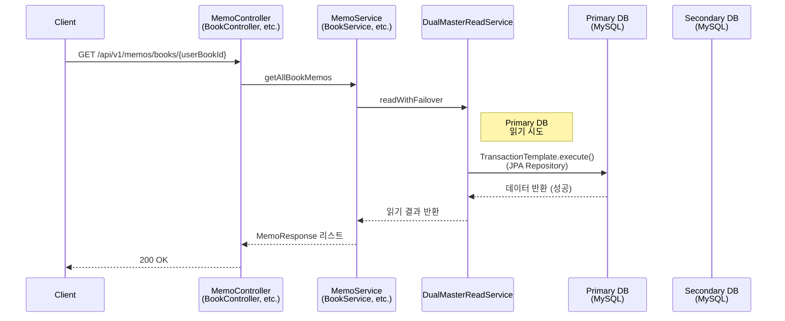
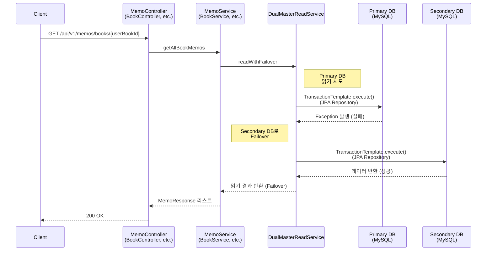
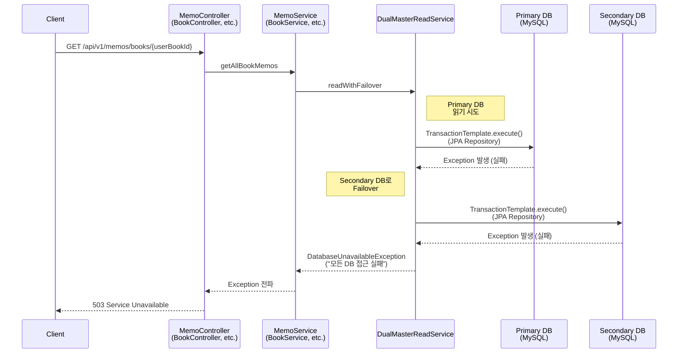
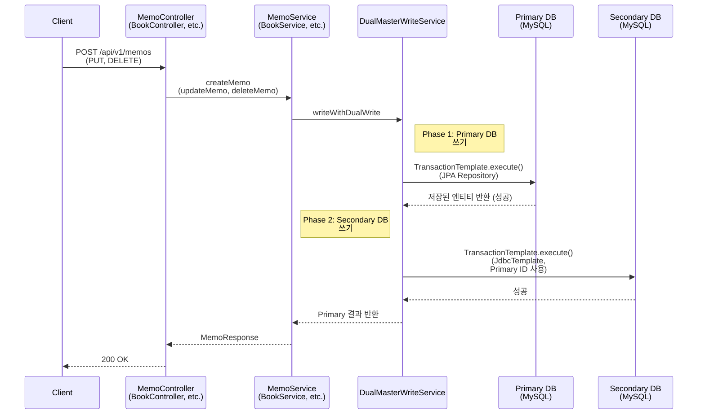
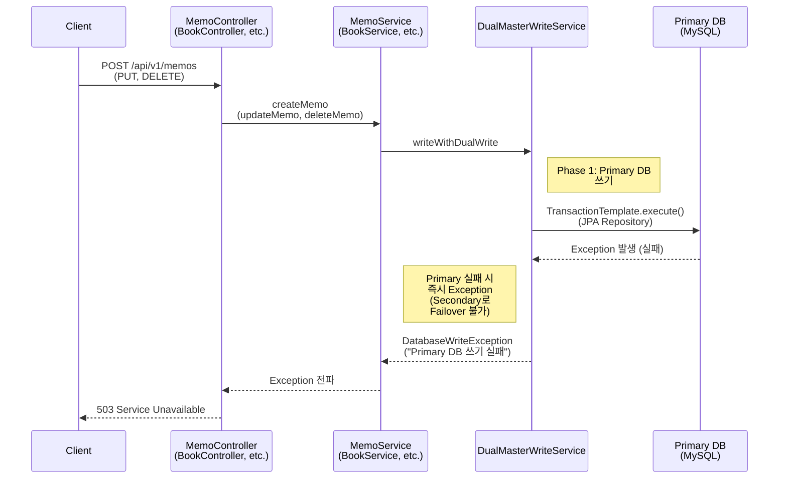
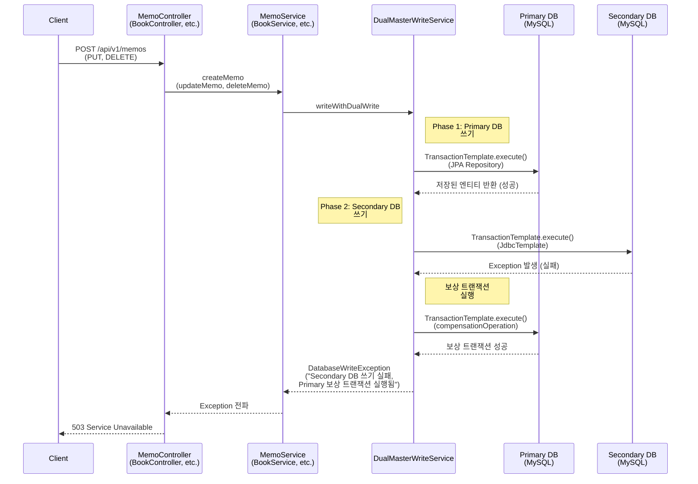
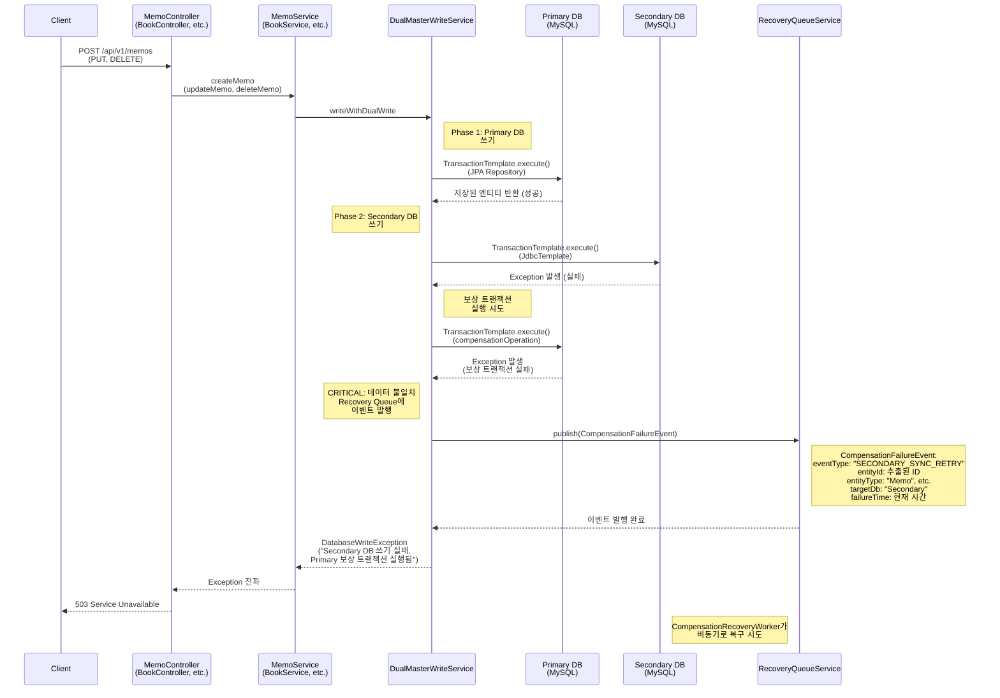

# 시나리오 2: MySQL 이중화 및 양방향 동기화 - Runtime View

> **작성일**: 2025-12-09  
> **목적**: 시나리오 2의 Runtime View를 설명하기 위한 시퀀스 다이어그램  
> **범위**: Read Flow와 Write Flow (Insert, Update, Delete 통합)

---

## 목차

1. [Read Flow 시퀀스 다이어그램](#read-flow-시퀀스-다이어그램)
2. [Write Flow 시퀀스 다이어그램](#write-flow-시퀀스-다이어그램)
3. [주요 컴포넌트 설명](#주요-컴포넌트-설명)

---

## Read Flow 시퀀스 다이어그램

### 시나리오 2-1: Primary DB 읽기 성공

### 시나리오 2-2: Primary DB 실패 → Secondary DB Failover 성공

### 시나리오 2-3: Primary DB 실패 → Secondary DB도 실패

---

## Write Flow 시퀀스 다이어그램

### 시나리오 2-4: Primary DB 쓰기 성공 → Secondary DB 쓰기 성공

### 시나리오 2-5: Primary DB 쓰기 실패

### 시나리오 2-6: Primary DB 쓰기 성공 → Secondary DB 쓰기 실패 → 보상 트랜잭션 성공

### 시나리오 2-7: Primary DB 쓰기 성공 → Secondary DB 쓰기 실패 → 보상 트랜잭션 실패 → Recovery Queue 발행

---

## 주요 컴포넌트 설명

### DualMasterReadService

**역할**: Read 작업에 대한 Failover 처리

**주요 메서드**:
- `readWithFailover(Supplier<T> readOperation)`: Primary DB에서 읽기 시도, 실패 시 Secondary DB로 Failover

**동작 방식**:
1. Primary DB에서 읽기 시도 (JPA Repository 사용)
2. 실패 시 Secondary DB로 자동 전환
3. 두 DB 모두 실패 시 `DatabaseUnavailableException` 발생

**사용 위치**:
- `MemoService.getAllBookMemos()`
- `BookService.getMyShelf()`
- `AuthService` (로그인 시 사용자 조회)
- `UserService` (사용자 프로필 조회)

### DualMasterWriteService

**역할**: Write 작업에 대한 Custom Dual Write 처리

**주요 메서드**:
- `writeWithDualWrite(Supplier<T> primaryWriteOperation, BiFunction<JdbcTemplate, T, Void> secondaryWriteOperation, Function<T, Void> compensationOperation, String entityType)`: Primary → Secondary 순차 쓰기

**동작 방식**:
1. **Phase 1**: Primary DB에 쓰기 (JPA Repository 사용)
   - 실패 시 즉시 `DatabaseWriteException` 발생 (Secondary로 Failover 불가)
2. **Phase 2**: Secondary DB에 쓰기 (JdbcTemplate 사용, Primary 결과의 ID 사용)
   - 성공 시 정상 반환
   - 실패 시 Phase 3으로 진행
3. **Phase 3**: Primary DB에 보상 트랜잭션 실행
   - 성공 시 `DatabaseWriteException` 발생 (Secondary 실패 알림)
   - 실패 시 Recovery Queue에 이벤트 발행 후 `DatabaseWriteException` 발생

**사용 위치**:
- `MemoService.createMemo()`, `updateMemo()`, `deleteMemo()`
- `BookService.addBookToShelf()`, `updateBookStatus()`, `updateBookDetail()`, `removeBookFromShelf()`
- `AuthService.login()` (사용자 디바이스 등록)
- `JwtService.saveRefreshToken()` (Refresh Token 저장)
- `UserDeviceService` (사용자 디바이스 관리)

### RecoveryQueueService

**역할**: 보상 트랜잭션 실패 시 비동기 복구를 위한 이벤트 발행

**주요 메서드**:
- `publish(CompensationFailureEvent event)`: 복구 이벤트 발행

**이벤트 정보**:
- `eventType`: "SECONDARY_SYNC_RETRY" (Secondary DB 동기화 재시도)
- `entityId`: 엔티티 ID
- `entityType`: "Memo", "UserShelfBook", "UserDevice" 등
- `targetDb`: "Secondary"
- `failureTime`: 실패 시간
- `errorMessage`: 에러 메시지

**후속 처리**:
- `CompensationRecoveryWorker`가 비동기로 이벤트를 처리하여 Secondary DB 정리 시도

### 데이터베이스 구성

**Primary DB**:
- 로컬 노트북 MySQL 8.0
- JPA Repository 사용 (읽기/쓰기 모두)
- Primary TransactionManager 사용

**Secondary DB**:
- Docker Compose MySQL 8.0
- JPA Repository 사용 (읽기)
- JdbcTemplate 사용 (쓰기)
- Secondary TransactionManager 사용

---

## 참고 사항

### Read Failover의 제약사항

- Secondary DB는 JPA Repository를 사용하지만, Primary와 동일한 Repository 인스턴스를 사용합니다.
- 향후 Secondary 전용 Repository를 별도로 구현할 수 있습니다.

### Write Dual Write의 제약사항

- Primary 실패 시 Secondary로 Failover 불가 (데이터 일관성 유지)
- Secondary 실패 시 Primary에 보상 트랜잭션 실행
- 보상 트랜잭션 실패 시 Recovery Queue에 이벤트 발행하여 비동기 복구 시도

### DELETE 작업의 보상 트랜잭션

- DELETE 작업의 경우 Primary에서 삭제된 데이터를 복구할 수 없으므로, 보상 트랜잭션은 Recovery Queue에 이벤트를 발행하여 Secondary DB 정리를 요청합니다.
- `CompensationRecoveryWorker`가 비동기로 Secondary DB에서 해당 데이터를 삭제 시도합니다.

---

**문서 버전**: 1.0  
**최종 업데이트**: 2025-12-09  
**작성자**: Development Team

